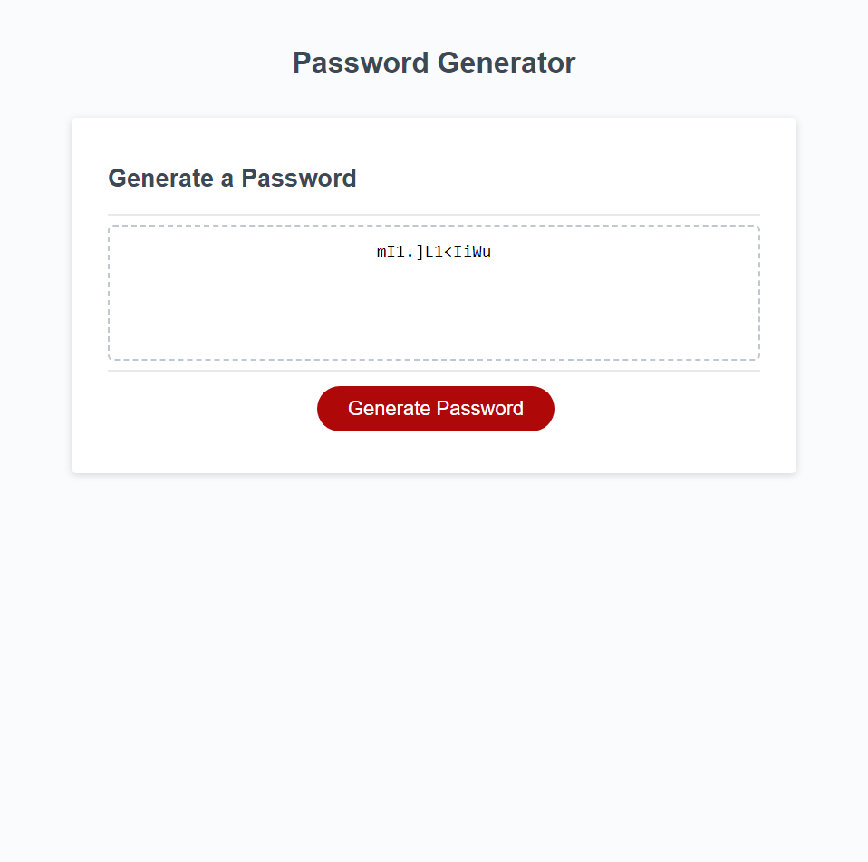

# 03-JavaScript-Password-Generator

## Description

- This project was built to create an app that could create a randomly generated password. the page uses promps and confirms to select length of password and different characters included in the generated password. I learned about creating variables and pulling data from them along with the use of functions and for loops to make recursive processes automated.

## Link

- [link](https://meister7k.github.io/03-JavaScript-Password-Generator/)

## Screenshot

## Cited

- youtube/ChatGPT

  - [Link](https://www.youtube.com/shorts/sWksH_V0SAQ)
  - John Komarnicki - [link](https://www.youtube.com/channel/UCr0D7PVNOHqB3Td7lVl_LKw/join)

- JavaScript "the comprehensive guide" by Phillip Ackermann,
  2022 Rheinwerk_Publishing.inc Boston, MA pg.115-127, 313,

- htmlcheatsheet.com/js https://htmlcheatsheet.com/js/
